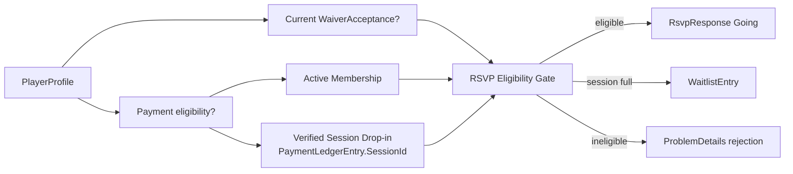
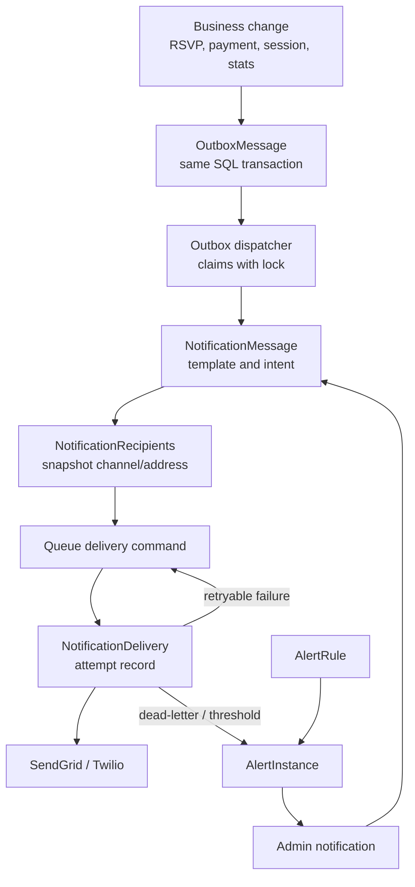

# Sprint 2 Data Relationship Flow

This diagram shows how the main SouthBaySoccer data areas relate to each other. It is intentionally
higher level than the ERD in `sprint-02-data-model.md`; use it to review the system flow before
implementation starts.

## End-to-End Data Flow

```mermaid
flowchart TD
    Identity["ApplicationIdentityUser<br/>ASP.NET Identity login"]
    Profile["PlayerProfile<br/>player, guest, stats anchor"]
    Emergency["EmergencyContact"]
    Merge["ProfileMerge<br/>guest claim audit"]

    WaiverDoc["WaiverDocument<br/>current version"]
    WaiverAccept["WaiverAcceptance<br/>signed by player"]

    StripeCustomer["StripeCustomerReference"]
    Membership["Membership<br/>monthly eligibility projection"]
    Ledger["PaymentLedgerEntry<br/>verified payment history"]
    Webhook["ProcessedWebhookEvent<br/>Stripe idempotency"]

    Season["Season"]
    Venue["Venue"]
    Recurrence["RecurrenceRule"]
    Session["Session<br/>game day"]

    Rsvp["RsvpResponse<br/>Going / Maybe / NotGoing intent"]
    Waitlist["WaitlistEntry<br/>only waitlisted authority"]
    CheckIn["CheckIn<br/>actual attendance"]
    Override["AdminOverride<br/>audited exception"]

    Match["Match<br/>played game within session"]
    MatchTeam["MatchTeam<br/>side for one match"]
    Assignment["TeamAssignment<br/>player to match team"]
    Result["MatchResult"]

    Participant["PlayerMatchStats<br/>participation only"]
    Event["MatchEvent<br/>goals with optional assist"]
    Rating["PlayerRatingVote"]
    Like["PlayerLike"]
    Award["MatchAward<br/>MVP authority"]
    Correction["StatCorrection"]

    Outbox["OutboxMessage<br/>transactional event"]
    Notification["NotificationMessage<br/>logical message"]
    Recipient["NotificationRecipient<br/>snapshot destination"]
    Delivery["NotificationDelivery<br/>provider attempt"]

    AlertRule["AlertRule"]
    AlertInstance["AlertInstance"]
    Audit["AuditLogEntry"]

    Identity -->|"0..1 linked account"| Profile
    Profile --> Emergency
    Profile --> Merge
    Merge -->|"source and target profiles"| Profile

    WaiverDoc --> WaiverAccept
    Profile --> WaiverAccept

    Profile --> StripeCustomer
    Profile --> Membership
    Profile --> Ledger
    Webhook -->|"verified event creates/updates"| Ledger
    Webhook -->|"updates projection"| Membership

    Season --> Session
    Venue --> Session
    Recurrence -->|"generates occurrences"| Session

    Session --> Rsvp
    Session --> Waitlist
    Session --> CheckIn
    Session --> Override
    Profile --> Rsvp
    Profile --> Waitlist
    Profile --> CheckIn
    Profile --> Override
    Session -->|"optional drop-in payment scope"| Ledger

    Session --> Match
    Match --> MatchTeam
    MatchTeam --> Assignment
    Profile --> Assignment
    Match --> Result
    MatchTeam --> Result

    Match --> Participant
    Profile --> Participant
    Match --> Event
    Profile -->|"actor/scorer/assist"| Event
    Match --> Rating
    Profile -->|"voter"| Rating
    Profile -->|"rated"| Rating
    Match --> Like
    Profile -->|"giver"| Like
    Profile -->|"receiver"| Like
    Match --> Award
    Profile --> Award
    Match --> Correction
    Profile --> Correction

    Session -->|"domain events"| Outbox
    Webhook -->|"payment events"| Outbox
    Match -->|"stats published/corrected"| Outbox
    AlertInstance --> Notification
    Outbox --> Notification
    Notification --> Recipient
    Recipient --> Delivery

    AlertRule --> AlertInstance
    Outbox -->|"stuck/failed work can raise"| AlertInstance
    Delivery -->|"failed delivery can raise"| AlertInstance
    Webhook -->|"webhook failures can raise"| AlertInstance

    Profile -->|"admin/security actor"| Audit
    Override --> Audit
    Correction --> Audit
```

## Critical Eligibility Flow

## Notification and Alert Flow

## Review Notes

- `PlayerProfile` is the central business identity. Guests have a profile without an Identity user.
- Payments do not directly authorize RSVP unless they came from verified Stripe webhook state.
- RSVP intent, waitlist position, and actual check-in are separate records. Waitlisted state exists only in `WaitlistEntries`, not in `RsvpResponses`.
- Stats attach to `Match`, then roll up through `Match -> Session -> Season`. `PlayerMatchStats` stores participation only; goals and assists come from `MatchEvents`.
- `OutboxMessages` are not notifications. They are transactional facts that may later create
  notifications.
- Notification recipients snapshot the destination at send time so later profile edits do not
  rewrite delivery history.
- Alerts are deduplicated operational/business incidents that can create admin notifications.
