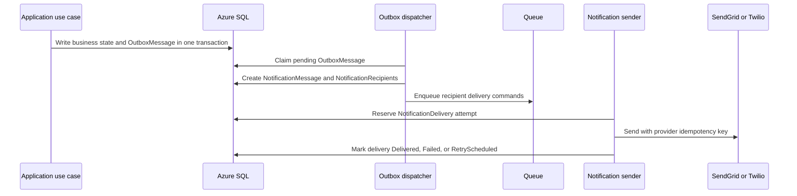

# Sprint 2 Data Model and Persistence Plan

This sprint defines the target Azure SQL data model before backend implementation starts. It is
based on the current `SouthBaySoccer.Domain`, `SouthBaySoccer.Application`,
`SouthBaySoccer.Contracts`, `_specs/design.md`, and `documentation/architecture.md`.

No tables in this document should be implemented as client-side SQLite product authority. Azure SQL
behind the Function App remains the system of record.

## Sprint Goal

Produce a production-ready persistence design for the serverless Azure SQL backend, including
notifications and operational alerts, so M1 through M10 can be implemented without changing the
core entity grain.

## Scope

Included:

- Identity and profile persistence.
- Authentication operational records.
- Waivers.
- Stripe-backed membership and payment ledger.
- Seasons, venues, recurring sessions, RSVP, waitlist, and check-in.
- Match, team, raw stat, rating, like, award, and correction records.
- Outbox, notification dispatch, alerting, and audit records.
- Required relationships, uniqueness rules, concurrency controls, retention rules, and high-risk
  indexes.
- Entity Framework Core schema-creation and schema-validation rules.

Excluded:

- Physical migration files.
  This sprint defines migration requirements, but does not create the migration files yet.
- EF Core entity implementation.
- Function App endpoint implementation.
- Materialized leaderboard tables. Leaderboards are derived from raw match rows unless a measured
  performance need justifies a documented projection later.

## Design Rules

- Domain entities use `Guid` primary keys.
- Mutable domain tables inherit the `BaseEntity` shape: `Id`, `CreatedAt`, `CreatedBy`,
  `UpdatedAt`, `UpdatedBy`, `IsDeleted`.
- All backend timestamps are UTC.
- Identity tables use ASP.NET Core Identity persistence and do not inherit `BaseEntity`.
- Security and operational records that prevent replay or preserve audit history are not soft
  deleted. They use explicit retention and purge policies instead.
- Stripe webhook events are the payment authority. Client redirects and admin actions never mark a
  player paid.
- RSVP capacity and waitlist promotion require serializable transactions scoped to one session.
- Stats attach to `Match`, not directly to `Session`.
- Waitlisted state lives only in `WaitlistEntries`. `RsvpResponses` records only explicit player
  intent values: Going, Maybe, or NotGoing.
- Persist raw stats only. `PlayerMatchStats` stores participation facts only; goals and assists are
  derived from `MatchEvents`, likes from `PlayerLikes`, ratings from `PlayerRatingVotes`, and MVP
  counts from explicit `MatchAwards`.
- Store enums as strings through EF Core value converters. Enum names are explicit data contracts;
  do not persist enum ordinals.
- Audit writes use an actor type plus optional actor id. Human writes use a `PlayerProfile` or
  Identity actor; webhook, timer, queue, migration, and system maintenance writes use a named system
  actor.
- EF Core migrations are the application-owned schema creation mechanism for Azure SQL.
  Schema is not created with ad hoc SQL scripts, `EnsureCreated`, or Function cold-start code.
- EF Core model configuration is the first validation boundary for table names, relationships,
  delete behavior, value converters, indexes, check constraints, rowversion columns, and max lengths.
- Schema correctness is proven by generated migrations plus `Infrastructure.Tests` against SQL
  Server-compatible infrastructure. Tests must inspect the EF model/migration output and exercise
  database-enforced constraints.

## ERD

```mermaid
erDiagram
    ApplicationIdentityUser ||--o| PlayerProfile : "optional login"
    PlayerProfile ||--o{ EmergencyContact : has
    PlayerProfile ||--o{ ProfileMerge : "source or target"
    PlayerProfile ||--o{ RefreshToken : owns
    PlayerProfile ||--o{ WhatsAppSignInChallenge : requests

    WaiverDocument ||--o{ WaiverAcceptance : accepted_as
    PlayerProfile ||--o{ WaiverAcceptance : signs

    PlayerProfile ||--o{ StripeCustomerReference : maps_to
    PlayerProfile ||--o{ Membership : has
    PlayerProfile ||--o{ PaymentLedgerEntry : pays
    Session ||--o{ PaymentLedgerEntry : "drop-in scope"
    ProcessedWebhookEvent ||--o{ PaymentLedgerEntry : produces

    Season ||--o{ Session : contains
    Venue ||--o{ Session : hosts
    RecurrenceRule ||--o{ Session : generates

    Session ||--o{ RsvpResponse : has
    Session ||--o{ WaitlistEntry : has
    Session ||--o{ CheckIn : has
    PlayerProfile ||--o{ RsvpResponse : submits
    PlayerProfile ||--o{ WaitlistEntry : joins
    PlayerProfile ||--o{ CheckIn : attends
    PlayerProfile ||--o{ AdminOverride : authorizes
    Session ||--o{ AdminOverride : scopes

    Session ||--o{ Match : contains
    Match ||--o{ MatchTeam : has
    Match ||--o{ MatchResult : records
    MatchTeam ||--o{ TeamAssignment : includes
    PlayerProfile ||--o{ TeamAssignment : assigned

    Match ||--o{ PlayerMatchStats : has
    PlayerProfile ||--o{ PlayerMatchStats : records
    Match ||--o{ MatchEvent : has
    Match ||--o{ PlayerRatingVote : has
    Match ||--o{ PlayerLike : has
    Match ||--o{ MatchAward : has
    Match ||--o{ StatCorrection : audits

    OutboxMessage ||--o{ NotificationMessage : materializes
    NotificationMessage ||--o{ NotificationRecipient : targets
    NotificationRecipient ||--o{ NotificationDelivery : attempts
    AlertRule ||--o{ AlertInstance : raises
    AlertInstance ||--o{ NotificationMessage : notifies
    PlayerProfile ||--o{ AuditLogEntry : "actor"
```

## Tables by Area

### Identity and Profiles

| Table | Purpose | Relationships | Key rules |
|---|---|---|---|
| `AspNetUsers` | ASP.NET Core Identity users. | Optional 1:1 with `PlayerProfiles`. | `Guid` key through `IdentityUser<Guid>`. Not a Domain `BaseEntity`. |
| `AspNetRoles` | Identity roles. | Many-to-many with users through `AspNetUserRoles`. | Seed known role names from `PlayerRole`. |
| `AspNetUserRoles` | Identity role membership. | `UserId` to `AspNetUsers`; `RoleId` to `AspNetRoles`. | Unique user-role pair. |
| `AspNetUserClaims` | Claims for authorization. | `UserId` to `AspNetUsers`. | Avoid storing secrets or provider tokens. |
| `AspNetRoleClaims` | Claims attached to roles. | `RoleId` to `AspNetRoles`. | Used to satisfy policies. |
| `AspNetUserLogins` | External login rows, if used. | `UserId` to `AspNetUsers`. | Unique provider key. |
| `AspNetUserTokens` | Identity token storage. | `UserId` to `AspNetUsers`. | Provider tokens only when needed. |
| `PlayerProfiles` | Stats, roster, RSVP, and guest anchor. | Optional `IdentityUserId` to `AspNetUsers`. Parent for most domain records. | `IdentityUserId` nullable for guests. Unique filtered index where `IdentityUserId is not null`. |
| `EmergencyContacts` | Private emergency contact data. | `PlayerProfileId` to `PlayerProfiles`. | Never exposed in public rosters or logs. |
| `ProfileMerges` | Audit trail for guest profile claim/retirement. | `SourcePlayerProfileId` and `TargetPlayerProfileId` to `PlayerProfiles`. | Source and target cannot match. Records stat reassignment state. |

### Authentication and Security Operations

| Table | Purpose | Relationships | Key rules |
|---|---|---|---|
| `RefreshTokens` | Hashed rotating refresh tokens. | `IdentityUserId` to `AspNetUsers`; optional `PlayerProfileId` to `PlayerProfiles`. | Not soft-deleted. Store hash, family id, expires, consumed, revoked, replaced-by. Unique token hash. |
| `DataProtectionKeys` | Shared Identity/Data Protection keys. | None. | Managed by Data Protection EF storage. |
| `WhatsAppSignInChallenges` | Pickup Pal WhatsApp one-time challenge lifecycle. | Optional `PlayerProfileId` to `PlayerProfiles`. | Not reusable. Store challenge hash/token hash, phone hash or masked phone, callback hash, expiry, consumed time. Do not store raw one-time token. |
| `IdempotencyKeys` | Replay protection for side-effecting HTTP commands. | `IdentityUserId` to `AspNetUsers`; optional `PlayerProfileId`. | Unique `(IdentityUserId, OperationName, Key)`. Store request hash, status, response metadata, expiry. |

### Waivers

| Table | Purpose | Relationships | Key rules |
|---|---|---|---|
| `WaiverDocuments` | Versioned waiver and code-of-conduct documents. | Parent to `WaiverAcceptances`. | One current published version at a time. |
| `WaiverAcceptances` | Player acceptance of a specific waiver version. | `WaiverDocumentId` to `WaiverDocuments`; `PlayerProfileId` to `PlayerProfiles`. | Unique `(PlayerProfileId, WaiverDocumentId)`. Acceptance timestamp UTC. |

### Payments and Stripe

| Table | Purpose | Relationships | Key rules |
|---|---|---|---|
| `StripeCustomerReferences` | Local player to Stripe customer mapping. | `PlayerProfileId` to `PlayerProfiles`. | Unique `StripeCustomerId`; usually unique active `PlayerProfileId`. |
| `Memberships` | Local projection of Stripe membership state. | `PlayerProfileId` to `PlayerProfiles`. | Updated only by verified Stripe events. Store provider timestamps/version markers. |
| `PaymentLedgerEntries` | Immutable payment ledger from verified events. | `PlayerProfileId` to `PlayerProfiles`; optional `SessionId` to `Sessions`; optional `ProcessedWebhookEventId` to `ProcessedWebhookEvents`. | Not manually edited. Newest first queries require index on `(PlayerProfileId, OccurredAtUtc desc)`. |
| `ProcessedWebhookEvents` | Idempotency record for provider webhooks. | Parent to `PaymentLedgerEntries`. | Not soft-deleted. Unique `(Provider, ProviderEventId)`. Store event type, provider created UTC, processed UTC, status. |

### Scheduling, RSVP, and Attendance

| Table | Purpose | Relationships | Key rules |
|---|---|---|---|
| `Seasons` | Explicit season scope. | Parent to `Sessions`. | Unique season label or year range. Never infer only from dates. |
| `Venues` | Saved playing locations. | Parent to `Sessions`. | Store map provider reference when available. |
| `RecurrenceRules` | Session generation rules. | Parent/generator for `Sessions`. | Store time zone id and recurrence details. |
| `Sessions` | Scheduled game day. | `SeasonId` to `Seasons`; `VenueId` to `Venues`; optional `RecurrenceRuleId` to `RecurrenceRules`. | Store UTC start/check-in/deadline; unique `OccurrenceKey` when present; rowversion. |
| `RsvpResponses` | Player attendance intent. | `SessionId` to `Sessions`; `PlayerProfileId` to `PlayerProfiles`. | Unique active `(SessionId, PlayerProfileId)`. Allowed status values: Going, Maybe, NotGoing. Waitlisted is not stored here. Intent is not attendance. Rowversion. |
| `WaitlistEntries` | Ordered session waitlist and the sole source of truth for waitlisted state. | `SessionId` to `Sessions`; `PlayerProfileId` to `PlayerProfiles`. | Unique active `(SessionId, PlayerProfileId)` and unique active `(SessionId, Position)`. Promotion deletes/completes the waitlist row and creates/updates one Going `RsvpResponse` in the same serializable transaction. |
| `CheckIns` | Actual attendance/check-in. | `SessionId` to `Sessions`; `PlayerProfileId` to `PlayerProfiles`; optional `CheckedInByPlayerProfileId`. | Unique `(SessionId, PlayerProfileId)` for active check-ins. |
| `AdminOverrides` | Audited waiver/payment/deadline override. | `SessionId` and `PlayerProfileId` to target; `AdminPlayerProfileId` to actor. | Required reason and policy type. Never use as payment authority. |

### Game Day, Teams, and Stats

| Table | Purpose | Relationships | Key rules |
|---|---|---|---|
| `Matches` | Played match within a session. | `SessionId` to `Sessions`. | Match order unique within session. |
| `MatchTeams` | Per-match side. | `MatchId` to `Matches`; optional `CaptainPlayerProfileId` to `PlayerProfiles`. | Team names/colors scoped to match. |
| `TeamAssignments` | Player to team for a match. | `MatchId` to `Matches`; `MatchTeamId` to `MatchTeams`; `PlayerProfileId` to `PlayerProfiles`. | Unique `(MatchId, PlayerProfileId)`. |
| `MatchResults` | Result/outcome per match team. | `MatchId` to `Matches`; `MatchTeamId` to `MatchTeams`. | Unique `(MatchId, MatchTeamId)`. Validate wins/draws/losses relative to team count. |
| `PlayerMatchStats` | One participant row per match. | `MatchId` to `Matches`; `PlayerProfileId` to `PlayerProfiles`. | Unique `(MatchId, PlayerProfileId)`. Includes guests. Participation only: played, minutes, started, goalkeeper/position flags. No goal or assist totals. |
| `MatchEvents` | Raw stat events. | `MatchId` to `Matches`; optional scorer/actor player; optional `AssistPlayerProfileId`; optional `MatchTeamId`. | Goals and own goals are event rows. A goal row may carry zero or one assist player. Assists are not separate event rows. Own goals are not credited to scorer totals. |
| `PlayerRatingVotes` | Peer rating votes. | `MatchId` to `Matches`; voter and rated IDs to `PlayerProfiles`. | Unique `(MatchId, VoterPlayerProfileId, RatedPlayerProfileId)`. Check voter != rated. Score 0 through 10. |
| `PlayerLikes` | Peer likes/appreciation. | `MatchId` to `Matches`; giver and receiver IDs to `PlayerProfiles`. | Unique `(MatchId, GiverPlayerProfileId, ReceiverPlayerProfileId)`. Check giver != receiver. |
| `MatchAwards` | Explicit awards such as MVP. | `MatchId` to `Matches`; `PlayerProfileId` to `PlayerProfiles`; optional awarded-by actor. | Authority for MVP. Ratings may inform UI/admin choice, but MVP is not computed directly from rating votes. Use filtered unique `(MatchId, AwardType)` for single-winner awards. |
| `StatCorrections` | Audit trail for corrections after lock/publish. | `MatchId` to `Matches`; optional `PlayerProfileId`; `CorrectedByPlayerProfileId` to `PlayerProfiles`. | Not soft-deleted. Store before/after payload and reason. |

### Notifications, Alerts, and Operations

Notifications and alerts should be modeled separately from the outbox. The outbox is the
transactional bridge from domain changes. Notification tables are the durable delivery plan and
delivery history.

| Table | Purpose | Relationships | Key rules |
|---|---|---|---|
| `OutboxMessages` | Durable domain/integration events written in the same transaction as business state. | Optional actor/aggregate references. Parent to `NotificationMessages` when a notification is materialized. | Not soft-deleted. Unique idempotency key when present. Status index for dispatcher. |
| `NotificationMessages` | A notification campaign/message to be sent. | Optional `OutboxMessageId`; optional `AlertInstanceId`; optional domain scope like `SessionId`. | Stores template key, channel intent, subject/body payload, priority, status, scheduled UTC, idempotency key. No provider secrets. |
| `NotificationRecipients` | Concrete recipients for a message. | `NotificationMessageId` to `NotificationMessages`; optional `PlayerProfileId`. | Store destination type and normalized destination hash/masked value. Unique `(NotificationMessageId, Channel, DestinationHash)` to avoid duplicate sends. |
| `NotificationDeliveries` | Provider delivery attempts and outcomes. | `NotificationRecipientId` to `NotificationRecipients`. | Not soft-deleted. Store provider message id, attempt number, status, provider timestamps, failure code, next retry UTC. |
| `AlertRules` | Operational or business alert definitions. | None or optional owner. | Examples: failed webhook threshold, outbox stuck, RSVP capacity reached, payment failure. Can be disabled. |
| `AlertInstances` | Raised alert occurrence. | `AlertRuleId` to `AlertRules`; optional `SessionId`, `PlayerProfileId`, or aggregate id. | Unique open alert key prevents alert storms. Status: Open, Acknowledged, Resolved, Suppressed. |
| `AuditLogEntries` | Audited sensitive/admin/security actions. | Optional `ActorPlayerProfileId`; optional aggregate references. | Not soft-deleted. No secrets, raw tokens, or full payment/provider payloads. |

## Notification and Alert Flow

Alert rules follow the same delivery path after an `AlertInstance` is raised. A raised alert may
materialize a `NotificationMessage` for admins.

## Authoritative Migration Constraint Checklist

This section is the single source of truth for EF configuration and migration constraints. Review sections below may explain why these constraints exist, but implementation must use this checklist.

- `PlayerProfiles`: filtered unique index on `IdentityUserId` where not null.
- `RefreshTokens`: unique `TokenHash`; index on `(IdentityUserId, FamilyId, RevokedAtUtc,
  ConsumedAtUtc)`.
- `WhatsAppSignInChallenges`: index on `(ChallengeId, ExpiresAtUtc, ConsumedAtUtc)`.
- `IdempotencyKeys`: unique `(IdentityUserId, OperationName, IdempotencyKey)`.
- `WaiverAcceptances`: unique `(PlayerProfileId, WaiverDocumentId)`.
- `StripeCustomerReferences`: unique `StripeCustomerId`.
- `ProcessedWebhookEvents`: unique `(Provider, ProviderEventId)`.
- `PaymentLedgerEntries`: index `(PlayerProfileId, OccurredAtUtc desc)` and `(SessionId,
  PlayerProfileId)` for drop-in eligibility.
- `Sessions`: filtered unique index on `OccurrenceKey` where not null; index `(StartsAtUtc,
  IsDeleted)`.
- `RsvpResponses`: filtered unique active `(SessionId, PlayerProfileId)`; index `(SessionId,
  Status)` for Going/Maybe/NotGoing only; check constraint rejects Waitlisted.
- `WaitlistEntries`: filtered unique active `(SessionId, PlayerProfileId)` and `(SessionId,
  Position)`.
- `CheckIns`: unique active `(SessionId, PlayerProfileId)`.
- `Matches`: unique `(SessionId, MatchNumber)`.
- `TeamAssignments`: unique `(MatchId, PlayerProfileId)`.
- `PlayerMatchStats`: unique `(MatchId, PlayerProfileId)`; check participation columns only, no persisted goal/assist totals.
- `MatchEvents`: indexes `(MatchId, EventType)` and `(PlayerProfileId, EventType)`; assists are modeled as nullable `AssistPlayerProfileId` on a goal row, so one goal can have at most one assist by shape. Add checks preventing assists on non-goal event types.
- `PlayerRatingVotes`: unique `(MatchId, VoterPlayerProfileId, RatedPlayerProfileId)` and check
  voter != rated.
- `PlayerLikes`: unique `(MatchId, GiverPlayerProfileId, ReceiverPlayerProfileId)` and check giver
  != receiver.
- `MatchAwards`: use a filtered unique `(MatchId, AwardType)` for single-winner awards such as MVP. `MatchAwards` is the MVP authority.
- `NotificationMessages`: index `(Status, ScheduledForUtc, Priority)`.
- `NotificationRecipients`: unique `(NotificationMessageId, Channel, DestinationHash)`.
- `NotificationDeliveries`: unique `(NotificationRecipientId, AttemptNumber)`; index `(Status,
  NextRetryAtUtc)`.
- `AlertInstances`: unique open alert key, for example `(AlertRuleId, DeduplicationKey)` where
  status is open or acknowledged.
- `OutboxMessages`: index `(Status, AvailableAtUtc, CreatedAt)` and unique idempotency key where
  present.
- Enum columns: string conversion with bounded max length and explicit allowed-value checks where practical.
- Audit columns: include actor type and optional actor id for human, webhook, timer, queue, migration, and system writes.

## Soft Delete and Retention

Soft-deleted mutable domain tables:

- `PlayerProfiles`
- `EmergencyContacts`
- `WaiverDocuments`
- `Memberships`
- `StripeCustomerReferences`
- `Seasons`
- `Venues`
- `RecurrenceRules`
- `Sessions`
- `RsvpResponses`
- `WaitlistEntries`
- `CheckIns`
- `Matches`
- `MatchTeams`
- `TeamAssignments`
- `MatchResults`
- `PlayerMatchStats`
- `MatchEvents`
- `PlayerRatingVotes`
- `PlayerLikes`
- `MatchAwards`

Not soft-deleted:

- ASP.NET Core Identity tables
- `RefreshTokens`
- `DataProtectionKeys`
- `WhatsAppSignInChallenges`
- `IdempotencyKeys`
- `ProfileMerges`
- `WaiverAcceptances`
- `PaymentLedgerEntries`
- `ProcessedWebhookEvents`
- `AdminOverrides`
- `StatCorrections`
- `OutboxMessages`
- `NotificationMessages`
- `NotificationRecipients`
- `NotificationDeliveries`
- `AlertRules`
- `AlertInstances`
- `AuditLogEntries`

Operational records require concrete retention before the table ships. MVP retention baseline:

| Table family | Retention | Purge owner | Cadence |
|---|---:|---|---|
| `RefreshTokens` | 180 days after expiry/revocation | Security maintenance Function | Daily |
| `WhatsAppSignInChallenges` | 30 days after expiry/consumption | Security maintenance Function | Daily |
| `IdempotencyKeys` | 30 days after completion/expiry, unless tied to a longer dispute window | API maintenance Function | Daily |
| `ProcessedWebhookEvents` | 400 days | Payment maintenance Function | Weekly |
| `PaymentLedgerEntries` | 7 years minimum | Manual/legal controlled archive, not automatic purge | Reviewed quarterly |
| `OutboxMessages` | 90 days after processed/dead-letter resolution | Messaging maintenance Function | Daily |
| `NotificationMessages`, `NotificationRecipients`, `NotificationDeliveries` | 180 days after terminal status | Messaging maintenance Function | Weekly |
| `AlertInstances` | 365 days after resolved/suppressed | Operations maintenance Function | Weekly |
| `AuditLogEntries`, `AdminOverrides`, `StatCorrections`, `ProfileMerges`, `WaiverAcceptances` | 7 years minimum | Manual/legal controlled archive, not automatic purge | Reviewed quarterly |

Purge jobs must be idempotent, paginated, observable, and excluded from Function cold start. Purges
must never remove records still needed for replay detection, payment disputes, legal audit, or active
support cases.

## Sprint 2 Work Items

1. Confirm this data model with product and engineering.
2. Resolve M0.4 decisions that affect persistence: SMS in v1, team-balancing mode, goalkeeper
   clean-sheet threshold.
3. Resolve the current `RsvpStatus.Waitlisted` enum mismatch before entity implementation: either remove
   `Waitlisted` from RSVP intent or split waitlist state into a separate enum. The database model uses
   `WaitlistEntries` as the only waitlisted authority.
4. Update `_specs/design.md` with notification and alert table language after this document is
   accepted.
5. Implement M1 domain entities and EF configurations in dependency order:
   - profile and identity link;
   - security operations;
   - waiver;
   - payment/webhook/outbox;
   - scheduling;
   - RSVP/check-in;
   - match/stat;
   - notification/alert operations.
6. Add `Infrastructure.Tests` for mappings, query filters, uniqueness, concurrency tokens,
   retention exceptions, and SQL Server-compatible transaction behavior.

## Acceptance Criteria

- The ERD and table list cover every current Contract DTO family and backend story family.
- Every table has a stated owner area, relationship, and delete/retention posture.
- Stripe, RSVP, refresh token, recurring session, notification, and rating-vote idempotency risks
  have unique constraints or transactional rules.
- Notification dispatch can send to multiple channels and recipients without duplicate sends.
- Alerts are deduplicated and can notify admins without bypassing the outbox/notification pipeline.
- The design is reviewed by a DBA and by a staff-engineer production-readiness check before M1
  implementation starts.

## Staff Engineer Production Readiness Gate

This design is acceptable for implementation only if the review confirms:

- No core aggregate uses the wrong grain.
- No payment state can be changed outside verified Stripe webhook flow.
- No RSVP capacity or waitlist invariant depends on client behavior.
- Operational records needed for idempotency are not hidden by soft delete.
- Notification delivery is idempotent per recipient/channel.
- Azure SQL serverless costs are controlled with targeted indexes, pagination, and no unbounded
  table scans in hot paths.
- Sensitive values are hashed, masked, or omitted from persistence and logs.

## DBA Review Addendum

Status: conditionally acceptable.

The DBA review found the table set aligned with the target architecture, but implementation must not start until EF configurations and the first migration explicitly include the constraints, indexes, concurrency tokens, retention semantics, and transaction patterns below. Without these, the model can pass CRUD tests and still fail under production concurrency.

Must-fix before implementation:

- `RsvpResponses` requires a filtered unique active constraint on `(SessionId, PlayerProfileId)` and a `rowversion` column.
- `WaitlistEntries` requires filtered unique active constraints on `(SessionId, PlayerProfileId)` and `(SessionId, Position)`.
- RSVP acceptance and waitlist promotion must use a narrow serializable transaction scoped to one `Session`, with bounded retry and jitter.
- `ProcessedWebhookEvents` must be non-soft-deleted and immutable, with unique `(Provider, ProviderEventId)` plus provider event timestamp/version data so older Stripe events cannot overwrite newer state.
- `PaymentLedgerEntries` must distinguish monthly membership from session-specific drop-in eligibility using nullable `SessionId` for drop-ins.
- `PlayerProfile` remains the FK anchor for waivers, RSVP, stats, payment eligibility, and guests. Stats must not anchor to Identity users.
- Identity tables remain ASP.NET Core Identity infrastructure tables, not `BaseEntity` domain tables.
- `ProfileMerges` must store source profile, target profile, merged-at UTC, merged-by, status, and enforce a unique completed source profile.
- Operational/security tables require explicit purge policies instead of soft delete: refresh tokens, processed webhooks, outbox, audit logs, notification messages, recipients, and deliveries.

Constraint checklist reference:

- Use Authoritative Migration Constraint Checklist as the implementation checklist. The DBA review originally called out the same risks, and this spec intentionally keeps one authoritative constraint section to avoid drift.

Notification and alert requirements:

- Keep `OutboxMessages` separate from `NotificationMessages`. Outbox is transactional durability; notification tables are delivery intent and delivery state.
- `OutboxMessages` needs status, available-at UTC, attempt count, lock token, locked-until UTC, processed-at UTC, dead-letter reason, correlation ID, and unique idempotency key when present.
- `NotificationMessages` represents logical message intent/template/payload, not provider attempts.
- `NotificationRecipients` snapshots channel and destination at send time. Store masked display value plus destination hash, not only a mutable profile contact reference.
- `NotificationDeliveries` stores provider attempts with attempt number, provider message ID where available, status, sanitized error category/code, next retry UTC, delivered/failed timestamps, and uniqueness for provider message ID where available.
- `AlertRules` and `AlertInstances` need severity, enabled flag, dedupe key, suppression window, last-fired UTC, acknowledged UTC, resolved UTC, and a filtered unique open alert `(AlertRuleId, DeduplicationKey)`.
- Do not store full provider payloads, raw tokens, full phone numbers, or payment data in notification or alert error columns.

Azure SQL serverless requirements:

- Do not run EF migrations during Function cold start. Use a controlled deployment step and least-privilege deployment identity.
- Serverless auto-pause can harm Stripe webhook latency and queue dispatch. Before production, either disable auto-pause for the primary database or define a warm strategy that meets provider timeout expectations.
- Use sequential GUID generation where possible. If random GUIDs are used, avoid clustering high-write tables on random GUID primary keys.
- Enable Query Store before production and watch RSVP, dashboard, leaderboard, payment history, and notification dispatch plans.
- Keep serializable transactions narrow and indexed by `SessionId`; do not call providers inside database transactions.
- Use EF Core SQL Server execution strategy correctly around explicit transactions.
- Partitioning is not needed for MVP, but purge jobs for refresh tokens, webhooks, outbox, notification delivery history, and audit logs must exist before production.
- Large reads must be paginated: payment history, rosters, match events, rating votes, notifications, audit logs, and alert instances.

## Staff Engineer Production Readiness Review

Verdict: acceptable to proceed to detailed M1 implementation planning, not yet acceptable to deploy or call production-ready.

What is sound:

- The model uses `PlayerProfile` as the person/stat/RSVP anchor, which correctly supports guests and future profile merges.
- The model keeps Identity as infrastructure persistence rather than polluting the Domain model.
- Stripe authority is preserved through immutable processed webhook records and payment ledger entries.
- RSVP and waitlist risks are identified as database-backed concurrency problems, not client-side behavior.
- Notifications are modeled as a durable pipeline: outbox event, logical notification, recipient snapshot, provider delivery attempt.
- Alerts are separated from notifications and can dedupe noisy operational conditions.

Production blockers before first release:

- Retention and purge policies must be written before any immutable operational table ships.
- The first EF migration must include filtered unique indexes, check constraints, and rowversion columns from this spec, not defer them to later cleanup.
- High-risk integration tests must prove Stripe duplicate/out-of-order webhooks, final-slot RSVP concurrency, waitlist promotion conflicts, outbox recovery, notification retry idempotency, and rating-vote constraints.
- Sensitive data minimization must be enforced in schema: hash tokens and destinations, mask phone/email display values, and avoid raw provider payload storage.
- Serverless SQL auto-pause and cold-start behavior must be validated against Stripe webhook timeouts and queue dispatch reliability.

Staff recommendation: proceed with this as the Sprint 2 table-design baseline. Treat implementation as gated by tests and constraints, not by entity scaffolding alone.
