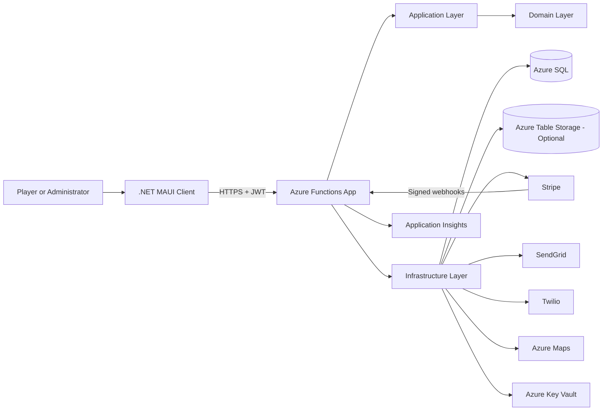
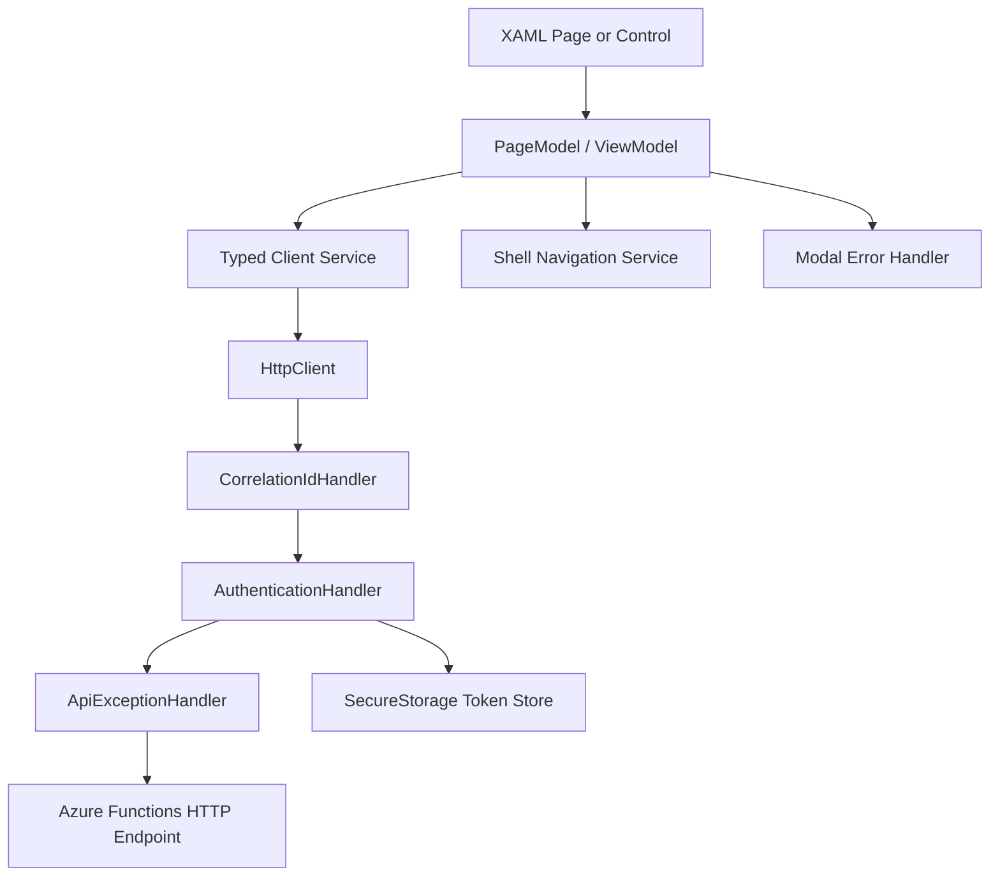
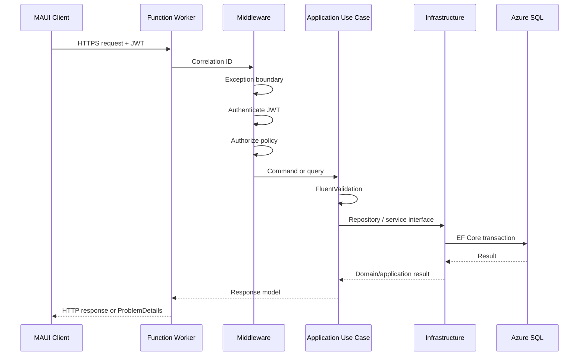
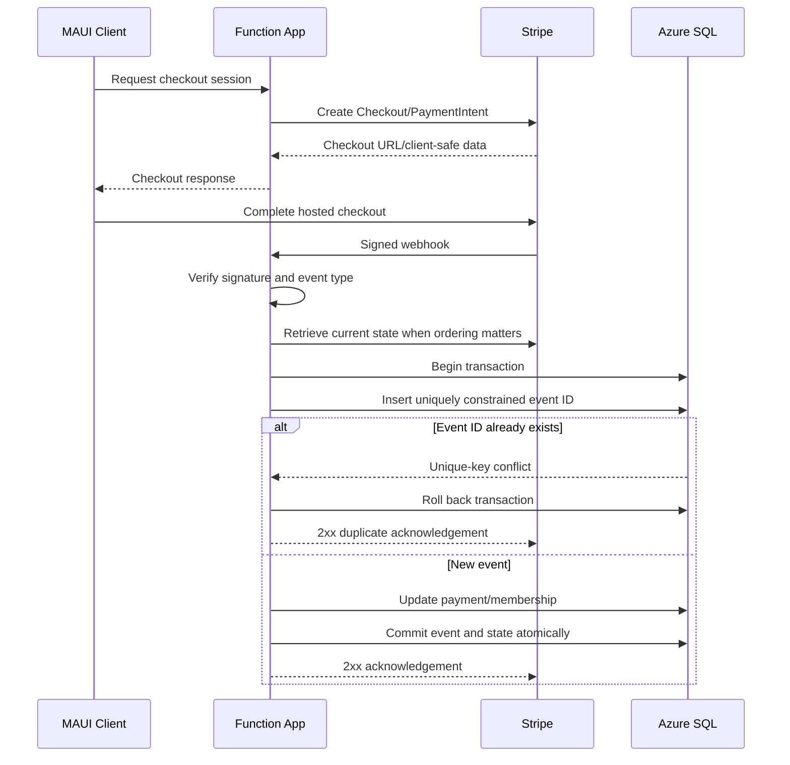
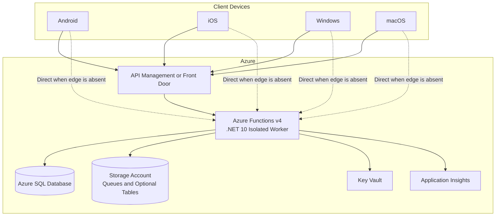

# SouthBaySoccer Architecture

## 1. Purpose

SouthBaySoccer is a cross-platform .NET MAUI application for operating paid pickup soccer
sessions. The system manages players, roles, waivers, memberships, payments, recurring sessions,
RSVP capacity and waitlists, game-day check-in, team assignment, and player statistics.

This document defines the target architecture. The current MAUI sample features should be migrated
incrementally; this architecture does not require a wholesale rewrite.

## 2. Architecture Decisions

| Concern | Decision |
|---|---|
| Client | .NET 10 MAUI single-project app using XAML, Shell, and MVVM |
| Backend | .NET 10 Azure Functions v4 using the isolated worker model |
| Primary database | Azure SQL Database |
| ORM | Entity Framework Core 10 |
| Authentication | ASP.NET Core Identity services with JWT access and refresh tokens |
| Authorization | Role- and policy-based authorization enforced by the Function App |
| Validation | FluentValidation in the Application layer |
| Object mapping | AutoMapper, optional and limited to nontrivial boundary mappings |
| Application pattern | Use-case services by default; CQRS is optional per feature |
| Payments | Stripe; verified webhooks are the source of truth |
| Email | SendGrid behind `IEmailService` |
| SMS | Twilio behind `ISmsService` |
| Maps | Azure Maps behind `IMapsService` |
| Secrets | Azure Key Vault through managed identity |
| Observability | Application Insights and structured logging |
| Optional NoSQL storage | Azure Table Storage for denormalized read models or operational records only |

### Why the primary database is relational

The core data is relational and transaction-sensitive:

- a player has roles, waivers, memberships, payments, RSVPs, attendance, and stats;
- a session has a venue, capacity, RSVP deadline, waitlist order, check-ins, teams, and matches;
- RSVP acceptance and waitlist promotion must update related records atomically;
- Stripe webhook processing must be idempotent;
- reporting requires joins and consistent filtering across seasons, players, and sessions.

Azure SQL and EF Core are therefore the primary persistence technology. Azure Table Storage is not
an EF Core database and does not provide the relational constraints or multi-record transaction
model required by this domain. It may be added for replaceable, denormalized data such as notification
delivery history, integration diagnostics, or precomputed dashboard projections.

## 3. System Context



The MAUI application never connects directly to Azure SQL and never calls privileged provider APIs.
It communicates with the Function App over HTTPS. Provider secrets and payment operations remain
server-side. The client may open provider-hosted user interfaces such as Stripe Checkout using a
short-lived URL created by the Function App.

## 4. Dependency Rules

The backend follows Clean Architecture:

```text
Domain <- Application <- Infrastructure
                 ^              ^
                 |              |
                 +--- Functions-+
```

- `Domain` has no dependency on Application, Infrastructure, Azure Functions, EF Core, or UI code.
- `Application` depends only on Domain and defines use cases and outbound interfaces.
- `Infrastructure` depends on Application and Domain and implements persistence and integrations.
- `Functions` is the composition root and invokes Application use cases.
- `Maui` depends on shared API contracts, not Domain entities or Infrastructure.
- Tests may reference the layer under test and its inward dependencies.

The Function App must not contain business rules. HTTP functions translate requests into use-case
calls and translate results into HTTP responses.

## 5. Target .NET Solution Structure

```text
SouthBaySoccer.slnx
├── src/
│   ├── SouthBaySoccer.Client/
│   │   ├── App.xaml
│   │   ├── AppShell.xaml
│   │   ├── MauiProgram.cs
│   │   ├── Pages/
│   │   ├── PageModels/
│   │   ├── Controls/
│   │   ├── Services/
│   │   │   ├── Api/
│   │   │   ├── Authentication/
│   │   │   ├── Navigation/
│   │   │   └── Storage/
│   │   ├── Http/
│   │   │   ├── AuthenticationHandler.cs
│   │   │   ├── CorrelationIdHandler.cs
│   │   │   └── ApiExceptionHandler.cs
│   │   ├── State/
│   │   ├── Resources/
│   │   └── Platforms/
│   │
│   ├── SouthBaySoccer.Contracts/
│   │   ├── Authentication/
│   │   ├── Players/
│   │   ├── Sessions/
│   │   ├── Rsvps/
│   │   ├── Payments/
│   │   ├── Stats/
│   │   └── Common/
│   │
│   ├── SouthBaySoccer.Domain/
│   │   ├── Entities/
│   │   │   ├── Common/
│   │   │   ├── Identity/
│   │   │   ├── Scheduling/
│   │   │   ├── Payments/
│   │   │   └── Stats/
│   │   ├── Enumerations/
│   │   ├── Events/
│   │   ├── Exceptions/
│   │   ├── Services/
│   │   ├── ValueObjects/
│   │   └── Interfaces/
│   │       └── Repositories/
│   │
│   ├── SouthBaySoccer.Application/
│   │   ├── Abstractions/
│   │   │   ├── Authentication/
│   │   │   ├── Messaging/
│   │   │   ├── Payments/
│   │   │   ├── Maps/
│   │   │   ├── Persistence/
│   │   │   └── Time/
│   │   ├── Behaviors/
│   │   ├── Features/
│   │   │   ├── Authentication/
│   │   │   ├── Players/
│   │   │   ├── Sessions/
│   │   │   ├── Rsvps/
│   │   │   ├── Payments/
│   │   │   └── Stats/
│   │   ├── Mapping/
│   │   ├── Models/
│   │   ├── Services/
│   │   └── Validation/
│   │
│   ├── SouthBaySoccer.Infrastructure/
│   │   ├── Persistence/
│   │   │   ├── SouthBaySoccerDbContext.cs
│   │   │   ├── Configurations/
│   │   │   ├── Interceptors/
│   │   │   ├── Migrations/
│   │   │   ├── Repositories/
│   │   │   └── UnitOfWork.cs
│   │   ├── Identity/
│   │   ├── Security/
│   │   ├── Payments/Stripe/
│   │   ├── Messaging/
│   │   │   ├── SendGrid/
│   │   │   └── Twilio/
│   │   ├── Maps/AzureMaps/
│   │   ├── Storage/Tables/
│   │   └── DependencyInjection.cs
│   │
│   └── SouthBaySoccer.Functions/
│       ├── Program.cs
│       ├── host.json
│       ├── local.settings.json.example
│       ├── Functions/
│       │   ├── Authentication/
│       │   ├── Players/
│       │   ├── Sessions/
│       │   ├── Rsvps/
│       │   ├── Payments/
│       │   ├── Webhooks/
│       │   └── Maintenance/
│       ├── Middleware/
│       │   ├── CorrelationIdMiddleware.cs
│       │   ├── ExceptionHandlingMiddleware.cs
│       │   ├── AuthenticationMiddleware.cs
│       │   └── AuthorizationMiddleware.cs
│       ├── Authorization/
│       ├── Extensions/
│       └── Security/
│
├── tests/
│   ├── SouthBaySoccer.Domain.Tests/
│   ├── SouthBaySoccer.Application.Tests/
│   ├── SouthBaySoccer.Infrastructure.Tests/
│   ├── SouthBaySoccer.Functions.Tests/
│   └── SouthBaySoccer.Client.Tests/
│
└── documentation/
    └── architecture.md
```

The existing `SouthBaySoccer/` MAUI project can be renamed or moved to
`src/SouthBaySoccer.Client/` when the solution expansion begins. That move should be a dedicated
change, separate from feature development.

## 6. MAUI Client Architecture

The client uses MVVM and is organized by presentation, client services, and transport concerns.
It is not the business layer and must not independently decide whether a player is eligible,
paid, authorized, or allowed to RSVP.



### Client responsibilities

- Render data and collect user input.
- Maintain loading, empty, populated, offline, and error states.
- Perform immediate presentation validation for user feedback.
- Store refresh tokens in platform secure storage.
- Attach access tokens to API requests through a delegating handler.
- Refresh an expired access token once and retry only when the request can be safely replayed.
- Route `401` responses to sign-in and show an access-denied state for `403`.
- Convert UTC timestamps to the user's local time only at the UI boundary.
- Call typed API services that use contracts from `SouthBaySoccer.Contracts`.

### Client HTTP handlers

`IHttpClientFactory` should build the transport pipeline:

1. `CorrelationIdHandler` adds a unique correlation ID.
2. `AuthenticationHandler` adds the bearer token and coordinates token refresh.
3. `ApiExceptionHandler` converts non-success responses and `ProblemDetails` into typed client
   exceptions.

Only one refresh operation should run when concurrent requests encounter an expired token. A retry
must use a cloned request with buffered replayable content because an `HttpRequestMessage` cannot be
sent twice. Side-effecting requests require an idempotency key before automatic replay; otherwise,
the client must return control to the user instead of guessing whether the operation succeeded.
Tokens, credentials, personal details, and payment data must never be logged.

The Function App persists idempotency records for replayable side-effecting operations, keyed by
authenticated user, operation, and idempotency key, with a unique constraint across those columns.
Before side effects, it atomically reserves a `Processing` record containing a canonical request
hash. Concurrent callers receive a deterministic in-progress response or wait for completion. A
completed repeated key with the same hash returns the stored original status/body; the same key with
a different hash is rejected as a conflict. Records use a documented expiry and retention policy.

### Client authorization

The client may use role and permission claims to hide or disable unavailable actions. This improves
the user experience but is not a security boundary. Every protected operation is authorized again
by the Function App.

### Client data

The server is the system of record. Local SQLite may be retained only for an intentional offline
cache or migration support. Cached data must have an expiry strategy and must not determine payment,
waiver, role, or RSVP eligibility.

## 7. Azure Functions Entry Layer

Use Azure Functions v4 with the .NET isolated worker model and ASP.NET Core HTTP integration.
Functions are grouped by business capability, not by technical operation.

### Trigger types

- HTTP triggers expose versioned application endpoints such as `/api/v1/sessions`.
- HTTP triggers receive Stripe webhooks at a dedicated unauthenticated endpoint.
- Timer triggers create recurring sessions and perform maintenance. Recurring-session creation uses
  a deterministic occurrence key and unique database constraint so retries and scaled executions
  are idempotent.
- Queue triggers send email/SMS notifications and process retryable background work.

HTTP triggers that use application-managed JWT authentication use `AuthorizationLevel.Anonymous`.
This prevents Function keys from being confused with end-user authentication. Authentication and
authorization middleware enforce access before the function invokes a use case.

Authorization is fail-closed. Every HTTP function must declare exactly one endpoint classification:

- `[RequirePolicy("PolicyName")]` for authenticated endpoints; or
- `[AllowAnonymous]` for intentionally public endpoints such as sign-in and Stripe webhooks.

`EndpointPolicyResolver` reads this metadata from the target function. The authorization middleware
rejects an HTTP function that has no classification or conflicting classifications. Do not assume
that ASP.NET Core MVC `[Authorize]` attributes or its normal routing middleware run inside the
Functions isolated-worker pipeline.

### Function invocation pipeline



Recommended middleware order:

1. Correlation ID and request context.
2. Global exception handling.
3. JWT authentication.
4. Policy authorization.
5. Function execution.

Authentication validates the JWT signature, issuer, audience, lifetime, signing algorithm, and
required claims. Authorization evaluates the endpoint's declared policy against the authenticated
principal. Non-HTTP triggers use trigger-specific trust and authorization rules and are not treated
as anonymous HTTP endpoints.

The exception middleware maps known failures to RFC 7807-style `ProblemDetails`:

| Failure | HTTP status |
|---|---:|
| Validation failure | 400 |
| Missing or invalid token | 401 |
| Authenticated but forbidden | 403 |
| Entity not found | 404 |
| Domain or concurrency conflict | 409 |
| Rate limit exceeded | 429 |
| Unexpected error | 500 |

Unexpected failures are logged with a correlation ID. Responses must not expose stack traces,
connection strings, provider payloads, or personal/payment data.

## 8. Authentication, Identity, and Security

ASP.NET Core Identity supplies user storage, password hashing, lockout, roles, claims, reset tokens,
and email-confirmation tokens. EF Core Identity stores are persisted in Azure SQL.

`ApplicationIdentityUser : IdentityUser<Guid>` is an Infrastructure persistence type and does not
inherit the Domain `BaseEntity`. It is linked by `Guid` to the Domain `PlayerProfile`, which follows
the required entity audit and soft-delete rules. Identity tables use Identity's persistence model
and explicit lifecycle/retention rules rather than pretending to be Domain entities.

Because the backend is an Azure Functions isolated-worker application rather than an ASP.NET Core
MVC application:

- configure `AddIdentityCore<ApplicationIdentityUser>()`, roles, EF stores, and required token
  providers;
- use `UserManager<TUser>`, role stores, token providers, and Identity EF stores;
- issue application JWT access tokens through an `ITokenService`;
- do not depend on cookie authentication or MVC login pages;
- avoid coupling authentication flows to `SignInManager` behavior that requires a conventional
  ASP.NET Core request pipeline;
- validate bearer tokens in Functions middleware and populate a request user context;
- store refresh tokens as hashed, revocable records with expiry, device/session metadata, and
  rotation/reuse detection;
- revoke the complete refresh-token family when reuse is detected, using an atomic database
  operation;
- persist shared Data Protection keys for Identity tokens so scaled Function instances and
  deployments can validate the same tokens;
- rotate JWT signing keys through Key Vault while retaining valid previous public keys for the
  configured overlap period.

Initial roles are:

- `Owner`
- `Admin`
- `GameAdmin`
- `Captain`
- `Player`
- `Guest`

Prefer policies for meaningful permissions, for example:

- `CanManagePlayers`
- `CanManageSessions`
- `CanCheckInPlayers`
- `CanAssignTeams`
- `CanRecordStats`
- `CanViewFinancialStatus`

Role membership can satisfy policies, but use cases should request policies rather than scattering
role-name checks throughout the code.

Security requirements:

- HTTPS only.
- Short-lived access tokens and rotating refresh tokens.
- Password hashing and account lockout through Identity.
- Email confirmation and secure password reset.
- Secrets in Key Vault, accessed by managed identity.
- Azure SQL access through managed identity where supported.
- Least-privilege identities for the Function App and deployment pipeline.
- Rate limiting at Azure API Management or Azure Front Door when introduced.
- No secret provider keys in the MAUI package.
- No sensitive values in URLs, telemetry, or structured log properties.

## 9. Application and Business Layer

The Application project is the business-use-case layer. It coordinates domain behavior,
authorization context, validation, persistence, and external-service abstractions.

Example capabilities:

- register and maintain a player profile;
- accept a waiver and code of conduct;
- create recurring game sessions;
- RSVP and promote the next eligible waitlisted player;
- check payment and waiver eligibility before RSVP;
- check players in;
- assign balanced teams;
- record and publish match stats;
- start Stripe Checkout;
- process verified Stripe events idempotently;
- send transactional notifications.

Application interfaces include:

- `ICurrentUser`
- `IIdentityService`
- `ITokenService`
- `IPaymentGateway`
- `IEmailService`
- `ISmsService`
- `IMapsService`
- `IClock`

Repository and unit-of-work interfaces remain in
`Domain/Interfaces/Repositories` in accordance with the solution's dependency convention.
Application defines only use-case and external-provider ports.

The layer returns application result types or throws known application exceptions. It does not
return EF entities, Stripe SDK objects, Twilio objects, or Azure SDK models.

## 10. Validation

FluentValidation validators live beside the use case they validate.

Validation occurs at three levels:

1. The MAUI client performs presentation validation for immediate feedback.
2. The Application layer performs authoritative input validation.
3. The Domain layer protects invariants through behavior and value objects.

Examples:

- session capacity must be positive;
- RSVP deadline must precede session start;
- a player cannot have duplicate active RSVPs for a session;
- a player must have an accepted waiver and eligible payment state before RSVP;
- scores and stat values cannot be negative;
- role-sensitive operations require the appropriate policy.

Do not put FluentValidation or data annotations on Domain entities.

## 11. CQRS and Mapping

CQRS is optional. Use it where command and query behavior materially differ, not as a mandatory
wrapper around every method.

Use straightforward application services for simple features. Introduce command/query handlers
when a feature benefits from:

- distinct write rules and read projections;
- pipeline validation or authorization behaviors;
- idempotency;
- complex orchestration;
- independent query optimization;
- background command processing.

Example:

```text
Features/Rsvps/
├── Commands/
│   ├── SubmitRsvp/
│   └── PromoteWaitlist/
└── Queries/
    ├── GetSessionRoster/
    └── GetPlayerRsvpStatus/
```

CQRS does not require separate databases. Commands and queries initially use the same Azure SQL
database and unit of work. Optional Azure Table Storage projections may be introduced only after a
measured query or scaling need.

Season and career **leaderboards** are read projections, not maintained tables. Top scorers,
top assists, most appearances, highest average Rating, most Liked, and most MVP awards are computed
by `Features/Stats` query handlers from the raw rows (`MatchEvent`, `PlayerRatingVote`, `PlayerLike`,
`MatchAward`) aggregated across `Match → Session → Season`. Use the player-stats tie-breakers
(Goals → fewer appearances → Assists). These queries are the first candidates to be materialized to
an Azure Table Storage projection if a measured read or scaling need appears, but they are never
hand-maintained alongside the source rows.

AutoMapper is also optional. Use explicit mapping for small, security-sensitive, or behavior-heavy
models. AutoMapper profiles are appropriate for repetitive DTO projections, but configuration must
be validated in tests. Do not map client-supplied DTOs directly onto tracked entities because that
can unintentionally update protected fields.

## 12. Domain Layer

All Domain entities inherit `BaseEntity`:

```text
BaseEntity
├── Guid Id
├── DateTime CreatedAt
├── string? CreatedBy
├── DateTime? UpdatedAt
├── string? UpdatedBy
└── bool IsDeleted
```

All timestamps are UTC. Primary keys are `Guid`. Deletion is soft deletion unless a specifically
documented security or retention requirement requires physical erasure.

Suggested domain model:

```text
Identity
├── PlayerProfile          // stats anchor; login-optional (a guest has no Identity user)
├── EmergencyContact
└── ProfileMerge           // audit record linking a merged guest profile into a claimed account

Scheduling
├── Season                 // first-class, yearly; never inferred only from dates
├── Venue
├── RecurrenceRule
├── Session                // a scheduled game day; belongs to one Season
├── RsvpResponse
├── CheckIn
└── WaitlistEntry

Payments
├── Membership
├── PaymentLedger
├── StripeCustomerReference
└── ProcessedWebhookEvent

Compliance
├── WaiverDocument
└── WaiverAcceptance

Stats
├── Match                  // a completed game within a Session; reaches Season via Session
├── MatchTeam              // a side within a Match (bibs/colors); scoped to that Match only
├── TeamAssignment         // player ↔ MatchTeam for that Match (ephemeral; no team FK on profile)
├── PlayerMatchStats       // one row per player per Match: appearance/MP, minutes, started, GK flag
├── MatchEvent             // raw event: Goal | Assist | OwnGoal | YellowCard | RedCard (assist → its goal)
├── PlayerRatingVote       // voter → rated, per Match; integer Score 0–10; no self-vote
├── PlayerLike             // rater → liked, per Match; appreciation, deduped per rater/match
├── MatchAward             // explicit MVP / Man-of-the-Match award, per Match
├── MatchResult            // score line and outcome (W/D/L, goals for/against) per MatchTeam
└── StatCorrection         // auditable adjustment to a locked match's stats
```

`TeamAssignment` moved from Scheduling to Stats so the player↔team link lives with the
completed `Match` and `MatchTeam` it scopes. Teams are drafted on the day and recorded against the
match that was played, not the schedule.

This pickup-soccer domain has **no club, coach, competition, or league standing**. Teams are the
ad-hoc sides drafted on a game day, and the product's core deliverable is per-player performance over
time. `PlayerProfile` — not the Identity user — is the stats anchor, so guests and drop-ins who play
without an account still accrue a full stat history (`PlayerProfile.IsGuest = true`, no linked
`ApplicationIdentityUser`). When a guest later claims an account, a `ProfileMerge` record transfers
their career stats and preserves an audit trail.

Stats attach at the **`Match`** grain. A game day (`Session`) typically produces several short matches
with re-drafted sides; goals, assists, appearances, rating votes, likes, and MVP awards are all
recorded per `Match`, and season and career figures are aggregated across matches
(`Match → Session → Season`). Only raw rows are persisted — `MatchEvent`, `PlayerRatingVote`,
`PlayerLike`, `MatchAward` — and every rate/aggregate (G/A totals, average Rating, total Likes, MP,
MVP count) is derived on read, per the player-stats conventions. A `MatchAward` for MVP is recorded
explicitly rather than inferred, because it is a distinct leaderboard axis from Rating and Likes.

`PlayerRatingVote` carries `(MatchId, VoterPlayerProfileId, RatedPlayerProfileId, Score)` with
`Score` an integer 0–10. A player's match Rating is the average of the votes they received that
match, shown from the first vote (no quorum); the profile Rating is the average across the matches
they were rated in, and matches with no votes simply do not contribute. Enforce **no self-vote**
(`Voter != Rated`) and a **unique** `(MatchId, VoterPlayerId, RatedPlayerId)` so a voter rates each
peer at most once per match.

Important invariants:

- Stripe webhook state is the payment authority.
- A player must be payment-eligible and have a current waiver before RSVP, unless an authorized
  administrator records an explicit override.
- Session capacity and waitlist order are enforced transactionally.
- RSVP deadlines lock normal player changes.
- Published stats are lockable and changes are auditable.
- A season is explicit and is not inferred only from dates.
- Stats and rating votes attach at the `Match` grain; season and career figures are aggregated
  across matches via `Match → Session → Season`.
- Only raw stat rows are persisted (`MatchEvent`, `PlayerRatingVote`, `PlayerLike`, `MatchAward`);
  goals, assists, average Rating, total Likes, MP, and MVP counts are derived on read, never stored
  (an explicit, documented cached snapshot aside). Own goals are not credited to a scorer; at most
  one assist is credited per goal.
- Players rate peers, never themselves; one vote per voter per rated player per match. The match
  Rating is the integer-0–10 average of votes received, shown from the first vote; matches with no
  votes do not contribute to the career average.
- Teams are per-match and never persist across sessions; `PlayerProfile` has no team foreign key —
  the only player↔team link is `TeamAssignment`, scoped to a single `Match`.
- Every match participant, including guests, has a `PlayerMatchStats` row.
- A `PlayerProfile` is login-optional; a guest profile (`IsGuest = true`, no `ApplicationIdentityUser`)
  still accrues stats and may later be merged into a claimed account, transferring career stats with
  a `ProfileMerge` audit record.

Domain events can represent completed domain facts such as `PlayerWaitlistPromoted`,
`SessionCapacityReached`, or `PaymentStatusChanged`. The same database transaction that persists
the aggregate must also persist an outbox message. An idempotent dispatcher publishes pending
messages after commit and marks them delivered.

## 13. Infrastructure and Persistence

### EF Core 10

`SouthBaySoccerDbContext` is the EF Core unit of work implementation and contains DbSets for
aggregate persistence. Infrastructure provides a small `IUnitOfWork` abstraction when Application
code requires an explicit commit boundary.

Entity mappings use one `IEntityTypeConfiguration<T>` per entity:

```text
Persistence/Configurations/
├── PlayerProfileConfiguration.cs
├── SessionConfiguration.cs
├── RsvpResponseConfiguration.cs
├── MembershipConfiguration.cs
├── PaymentLedgerConfiguration.cs
├── PlayerMatchStatsConfiguration.cs
├── MatchEventConfiguration.cs
└── PlayerRatingVoteConfiguration.cs   // unique (MatchId, VoterPlayerId, RatedPlayerId); Voter != Rated
```

Configurations define:

- table and column names;
- keys and relationships;
- required values and maximum lengths;
- unique and filtered indexes;
- enum conversions;
- optimistic concurrency tokens;
- UTC timestamp expectations;
- delete behavior;
- query indexes based on known access patterns.

Apply a global query filter for `IsDeleted == false` to normal mutable Domain entities. Save
interceptors populate audit fields using `ICurrentUser` and `IClock`. Application code soft-deletes
entities rather than calling `DbSet.Remove()`.

Immutable security and operational records are explicit exceptions to general soft-delete behavior:
processed webhook IDs, refresh-token reuse/revocation history, audit records, and outbox messages
must not become replayable by setting `IsDeleted`. Give these records documented retention and
physical-purge policies appropriate to security, legal, and operational requirements.

### Repositories and unit of work

Repositories are aggregate- or use-case-specific. Avoid a generic repository that merely duplicates
every `DbSet` operation. If a shared repository interface is retained, constrain it with
`where T : BaseEntity`.

Never expose `IQueryable` outside Infrastructure. Return domain entities for writes and projected
read models for queries. Large tables such as RSVP responses, matches, per-match stats, match
events, payment ledger entries, and especially rating votes — which grow on the order of
participants² per match — must always be filtered and paginated.

The unit of work:

- coordinates one scoped EF Core `DbContext` shared by all repositories in a function invocation;
- commits a complete application operation once;
- uses a `Serializable` transaction for RSVP acceptance and waitlist promotion, scoped to one
  session, with a `rowversion` concurrency token and unique active-RSVP constraint as additional
  safeguards;
- executes user-created transactions through the configured Azure SQL execution strategy;
- retries safe serialization or optimistic-concurrency conflicts at most three times with jitter,
  then returns `409 Conflict`;
- propagates `CancellationToken` through EF Core and external I/O;
- writes outbox records in the same transaction as business state.

Production migrations run as a controlled deployment step using a dedicated least-privilege
identity. The Function App must not automatically migrate the database during cold start because
multiple scaled instances could race. The operational runbook lives in
[`_specs/controlled-migrations.md`](../_specs/controlled-migrations.md).

### External services

Each provider is behind an Application interface:

| Interface | Infrastructure implementation |
|---|---|
| `IPaymentGateway` | Stripe |
| `IEmailService` | SendGrid |
| `ISmsService` | Twilio |
| `IMapsService` | Azure Maps |
| `IIdentityService` | ASP.NET Core Identity |
| `ITokenService` | Signed JWT and refresh-token implementation |

Use typed `HttpClient` instances and provider SDK clients registered through dependency injection.
Set timeouts, honor cancellation tokens, and apply retries only to operations that are safe to
repeat. External requests that create side effects require idempotency keys.

## 14. Stripe Payment Architecture

Stripe is the source of truth for membership and payment status.



The webhook function:

- permits anonymous HTTP access so Stripe can call it;
- verifies the signature against the raw request body;
- rejects invalid signatures;
- inserts each Stripe event ID under a non-filtered unique database constraint;
- performs event recording and local state changes atomically in one transaction;
- treats a unique-key conflict as an already-processed successful duplicate;
- prevents an older event from overwriting newer membership state by recording provider event
  timestamps/version markers and retrieving current Stripe state when event ordering is material;
- updates local payment projections only from verified events;
- responds quickly and queues slow follow-up work;
- never trusts a client redirect as proof of payment.

## 15. Reliability, Background Work, and Observability

Use Azure Storage Queues or Service Bus for retryable side effects such as email and SMS. The Azure
SQL transaction records business state and its outbox message atomically. An idempotent dispatcher
publishes the message and records delivery; retries recover safely from crashes between publish and
delivery acknowledgement.

Recommended operational patterns:

- correlation IDs across MAUI, Functions, and provider calls;
- structured logs with no personal or payment details;
- Application Insights traces, dependencies, failures, and custom business metrics;
- health and synthetic availability checks;
- dead-letter handling and alerting for failed notification or webhook work;
- idempotent queue consumers;
- cancellation tokens throughout asynchronous operations;
- timeout and retry policies appropriate to each provider;
- optimistic concurrency for RSVP capacity and waitlist promotion.
- a stable recurring-session occurrence key with a unique database constraint so concurrent or
  replayed timer executions cannot create duplicate sessions.

## 16. Deployment Topology



For .NET 10 on Linux, select a currently supported Azure Functions hosting plan such as Flex
Consumption rather than assuming the legacy Linux Consumption plan supports the target runtime.

## 17. Testing Strategy

- `Domain.Tests`: pure domain tests with no EF Core or provider mocks.
- `Application.Tests`: use-case tests with Moq and FluentAssertions.
- `Infrastructure.Tests`: EF Core integration tests against SQL Server-compatible infrastructure;
  test entity mappings, query filters, concurrency, transactions, and Identity stores.
- `Functions.Tests`: middleware, authorization, request/response, webhook signature, and
  `ProblemDetails` tests.
- `Client.Tests`: page-model, API client, token refresh, error-state, and navigation tests.

Use xUnit and the naming pattern `MethodName_StateUnderTest_ExpectedBehavior`. Run focused tests
during development and the full test suite before committing.

Required high-risk scenarios include:

- fail-closed endpoint classification and intentional anonymous endpoints;
- JWT issuer, audience, expiry, signing-key rotation, and invalid-signature handling;
- atomic refresh-token rotation, reuse detection, and token-family revocation;
- concurrent RSVP requests at the final capacity slot and waitlist promotion conflicts;
- concurrent duplicate and out-of-order Stripe webhook events;
- outbox recovery after commit, publish, and acknowledgement crash windows;
- replayed or concurrently executed recurring-session timers;
- EF Core execution-strategy behavior around explicit Azure SQL transactions;
- rating-vote integrity: rejected self-votes, the unique `(MatchId, VoterPlayerId, RatedPlayerId)`
  constraint, and Rating averages derived correctly (including a match with zero votes);
- stat aggregation correctness: season and career G/A/MP/Rating/Likes/MVP totals summed across
  matches, own goals excluded, at most one assist per goal;
- guest profile stat capture and a `ProfileMerge` that transfers career stats without duplication.

## 18. Incremental Adoption

1. Keep the existing MAUI app running and extract shared API contracts.
2. Add Domain and Application projects with the first soccer feature.
3. Add Infrastructure with Azure SQL, EF Core 10, Identity, and migrations.
4. Add the Functions isolated-worker project with exception, authentication, and authorization
   middleware.
5. Implement authentication and player-profile endpoints.
6. Replace one MAUI sample repository flow with a typed API client.
7. Add sessions, waivers, RSVP/waitlist, and payment webhook features incrementally.
8. Add notifications, maps, check-in, teams, and stats after the core transactional flows are
   stable.

Each migration step should leave the solution buildable and avoid mixing unrelated sample removal
with new feature behavior.

## 19. Reference Documentation

- [Azure Functions .NET isolated worker guide](https://learn.microsoft.com/azure/azure-functions/dotnet-isolated-process-guide)
- [EF Core 10 features](https://learn.microsoft.com/ef/core/what-is-new/ef-core-10.0/whatsnew)
- [Configure ASP.NET Core Identity](https://learn.microsoft.com/aspnet/core/security/authentication/identity-configuration)
- [Data Protection key management](https://learn.microsoft.com/aspnet/core/security/data-protection/implementation/key-management)
- [ASP.NET Core JWT bearer authentication](https://learn.microsoft.com/aspnet/core/security/authentication/configure-jwt-bearer-authentication)
- [Stripe webhook guidance](https://docs.stripe.com/webhooks)

