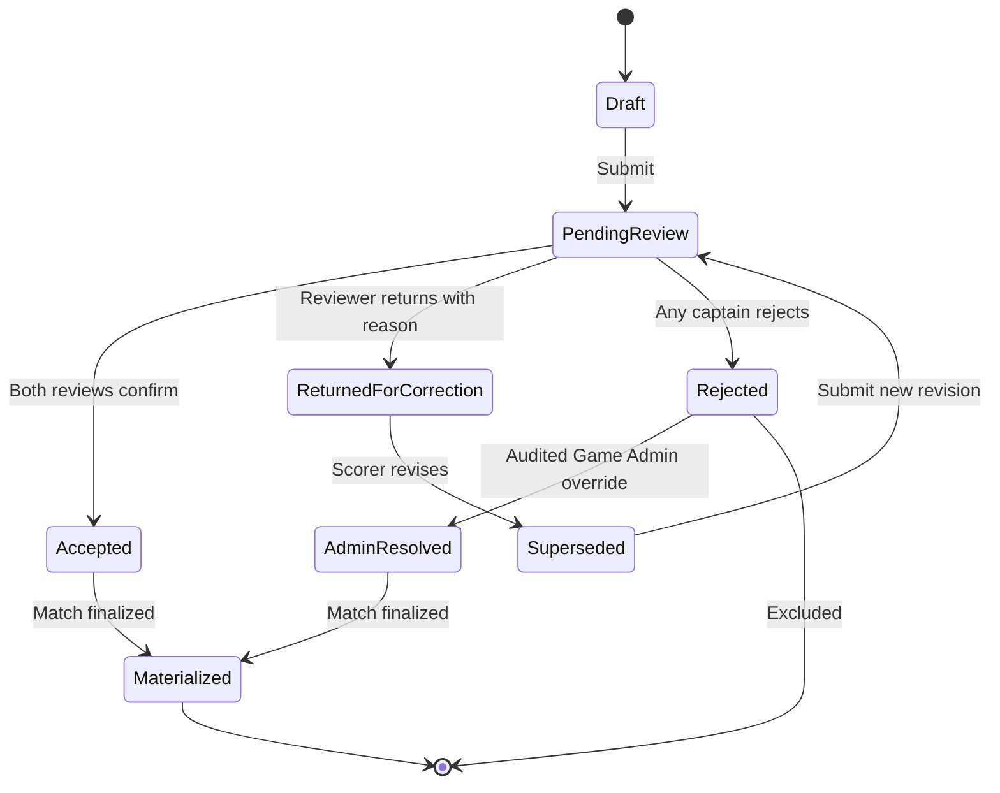

# Match Stats Confirmation Architecture — Review Plan

> **Status:** Proposed; saved for review before implementation.  
> **Scope:** Documentation and architecture only. Do not implement entities, migrations, APIs,
> handlers, or client behavior until this plan is approved.

## 1. Purpose

Define the authoritative lifecycle from RSVP through check-in, match-team assignment, captain
selection, goal-claim review, match publication, and leaderboard projection.

The approved architecture will be documented in `documentation/match-stats-flow.md` and referenced
by the main architecture, executable specifications, tasks, mobile wireframe, and agent memory.

## 2. Proposed end-to-end flow

```mermaid
flowchart TD
    RSVP["Player RSVPs Going"] --> ELIGIBLE{"Payment and waiver eligible?"}
    ELIGIBLE -- No --> BLOCKED["RSVP rejected"]
    ELIGIBLE -- Yes --> CHECKIN["Game Admin checks player in"]

    CHECKIN --> CREATE["Game Admin creates Match"]
    CREATE --> ASSIGN["Assign checked-in players to Match Team A or B"]
    ASSIGN --> CAPTAINS["Select one eligible Captain-role player per team"]

    CAPTAINS --> VALIDATE{"Captain is checked in and assigned to that team?"}
    VALIDATE -- No --> CAPTAIN_ERROR["Reject captain assignment"]
    VALIDATE -- Yes --> START["Start Match and lock teams/captains"]

    START --> PLAY["Match is played"]
    PLAY --> RESULT["Game Admin records provisional score"]
    RESULT --> REVIEW_WINDOW["Open configured stat-review window"]

    REVIEW_WINDOW --> CLAIM["Scorer submits one Goal Claim per goal with optional assister"]
    CLAIM --> PARTICIPANT{"Scorer and assister assigned to scoring team?"}
    PARTICIPANT -- No --> INVALID["Reject invalid claim"]
    PARTICIPANT -- Yes --> REVIEWERS["Create two review slots: Team A captain and Team B captain"]

    REVIEWERS --> SELF{"Captain is scorer or named assister?"}
    SELF -- Yes --> ADMIN_SUB["Game Admin substitutes for conflicted captain"]
    SELF -- No --> CAPTAIN_REVIEW["Captain reviews claim"]
    ADMIN_SUB --> DECISIONS
    CAPTAIN_REVIEW --> DECISIONS{"Review decisions"}

    DECISIONS -- Return for correction --> RETURNED["Record reason and return to scorer"]
    RETURNED --> BEFORE_DEADLINE{"Before review deadline?"}
    BEFORE_DEADLINE -- Yes --> REVISE["Scorer creates revised claim; prior revision is superseded"]
    REVISE --> REVIEWERS
    BEFORE_DEADLINE -- No --> ADMIN_QUEUE["Game Admin resolution queue"]

    DECISIONS -- Any captain rejects --> REJECTED["Claim rejected"]
    REJECTED --> ADMIN_OVERRIDE{"Audited Game Admin override?"}
    ADMIN_OVERRIDE -- No --> EXCLUDED["Exclude claim from official events"]
    ADMIN_OVERRIDE -- Yes --> RESOLUTION["Record reason and resolved claim values"]

    DECISIONS -- Both confirm --> ACCEPTED["Claim accepted pending finalization"]
    RESOLUTION --> ACCEPTED

    REVIEW_WINDOW --> DEADLINE{"Review deadline reached?"}
    DEADLINE -- Yes --> LOCK_REVIEW["Lock player revisions"]
    LOCK_REVIEW --> ADMIN_QUEUE
    ADMIN_QUEUE --> RESOLVE["Game Admin resolves pending, returned, missing-captain, and disputed claims"]
    RESOLVE --> ACCEPTED

    ACCEPTED --> RECONCILE{"Accepted goals per team equal provisional score?"}
    EXCLUDED --> RECONCILE
    RECONCILE -- No --> FIX["Game Admin amends score or claims with required audit reason"]
    FIX --> RECONCILE
    RECONCILE -- Yes --> FINALIZE["Game Admin finalizes Match"]

    FINALIZE --> EVENTS["Create official linked Goal and Assist MatchEvents"]
    EVENTS --> PARTICIPATION["Finalize PlayerMatchStats and MatchResult"]
    PARTICIPATION --> PUBLISH["Publish and lock Match"]

    PUBLISH --> PROJECTION["Recompute season and career read projections"]
    PROJECTION --> TOP10["Leaderboard shows top 10 qualifying players"]
    TOP10 --> ALL["View All provides search and paginated rankings"]
    PROJECTION --> PROFILE["Player profile shows career totals and overall rank"]

    PUBLISH --> CORRECTION{"Correction required later?"}
    CORRECTION -- Yes --> AUDIT["Create StatCorrection and audited amended events"]
    AUDIT --> PROJECTION

    PLAY --> RATINGS["Participants submit teammate ratings and likes during review window"]
    RATINGS --> DEDUPE["Enforce no self-vote and one vote/like per peer per Match"]
    DEDUPE --> PROJECTION
```



## 3. Architecture decisions to approve

- `RsvpResponse` records attendance intent.
- `CheckIn` records actual arrival.
- `TeamAssignment` records participation and team membership for one match.
- `MatchTeam` has an optional `CaptainPlayerProfileId`.
- A captain must hold the Captain role, be checked in, and be assigned to that match team.
- Teams and captains lock when the match starts. Later changes require an audited Game Admin action.
- Game Admin acts as reviewer when a team has no captain.
- Goal submissions are event-based:
  - One claim per goal.
  - A scorer is required.
  - At most one assister may be identified.
  - The scorer creates the claim.
  - Game Admin may create claims for guests or missing submissions.
- Both captains review every goal claim.
- A captain cannot review a claim that identifies them as scorer or assister; Game Admin fills that
  review slot.
- A returned claim requires a reason and may be revised before the review deadline.
- Any captain rejection rejects the claim by default.
- Game Admin may override a rejected claim only with a required audit reason.
- Claims remain separate from official `MatchEvent` records until match finalization.
- Game Admin is the only final publication authority.
- Accepted goal counts must reconcile with the provisional `MatchResult`.
- Only published and locked matches contribute to leaderboard projections.
- Post-publication changes require `StatCorrection`.

## 4. Proposed domain model

The final architecture document will include a Mermaid relationship diagram covering:

- `Session`
- `CheckIn`
- `Match`
- `MatchTeam`
- `TeamAssignment`
- `GoalClaim`
- `GoalClaimReview`
- `MatchEvent`
- `PlayerMatchStats`
- `MatchResult`
- `StatCorrection`

Proposed claim lifecycle:



## 5. Role and authorization model

| Actor | Proposed responsibilities |
|---|---|
| Player | Submit their own goal claims, revise returned claims before the deadline, rate eligible peers, and view published results. |
| Captain | Review each goal claim for the match unless conflicted; return with a reason, confirm, or reject. Captaincy is assigned per match team. |
| Game Admin | Check players in, create matches, assign teams and captains, substitute for missing/conflicted captains, resolve claims, reconcile the score, publish, and lock the match. |
| Admin/Owner | Inherit Game Admin authority and perform audited post-publication corrections when authorized. |

Server-side policies remain authoritative. Client-side control visibility is user experience only.

## 6. Leaderboard behavior

- The initial leaderboard displays the top 10 qualifying players for the selected season and metric.
- Supported primary metrics are Goals, Assists, Rating, and MVP.
- “View all” opens a searchable, paginated ranking.
- Players with a zero value for the selected competitive metric are excluded from that metric’s
  ranked list.
- A player profile may show the player’s overall rank even when they are outside the top 10.
- Rankings are read projections computed from published, locked match data.
- Rejected, returned, pending, or superseded claims never affect rankings.
- Audited post-publication corrections trigger projection recomputation.

## 7. Documentation deliverables after approval

1. Create `documentation/match-stats-flow.md` as the authoritative architecture reference.
2. Add the complete flowchart, domain relationship diagram, claim state diagram, authorization
   matrix, invariants, and failure paths.
3. Update `documentation/architecture.md` to summarize and link to the detailed flow.
4. Update `_specs/requirements.md` with Gherkin scenarios for:
   - Captain eligibility and same-team enforcement.
   - Team and captain locking at match start.
   - Dual-captain review.
   - Conflicted captain substitution.
   - Claim return, revision, rejection, and audited override.
   - Review-deadline escalation.
   - Score reconciliation.
   - Publication and locking.
   - Leaderboard inclusion and pagination.
5. Update `_specs/design.md` and `_specs/tasks.md` with the domain, API, and implementation impact.
6. Update `documentation/mobile-wireframes.html`:
   - Replace “Confirm teammates” with “Pending team submissions.”
   - Show dual-review status and Game Admin reconciliation states.
7. Add durable memory and references in agent guidance.

## 8. Validation and eventual commit

- Validate Mermaid syntax and diagram completeness.
- Verify terminology is consistent across architecture, requirements, design, tasks, wireframe, and
  memory.
- Run `git diff --check`.
- Keep the change documentation-only.
- After review approval, commit as:

```text
docs: define match stat confirmation architecture
```

No entities, migrations, handlers, endpoints, or client behavior should be added with this
documentation commit.
