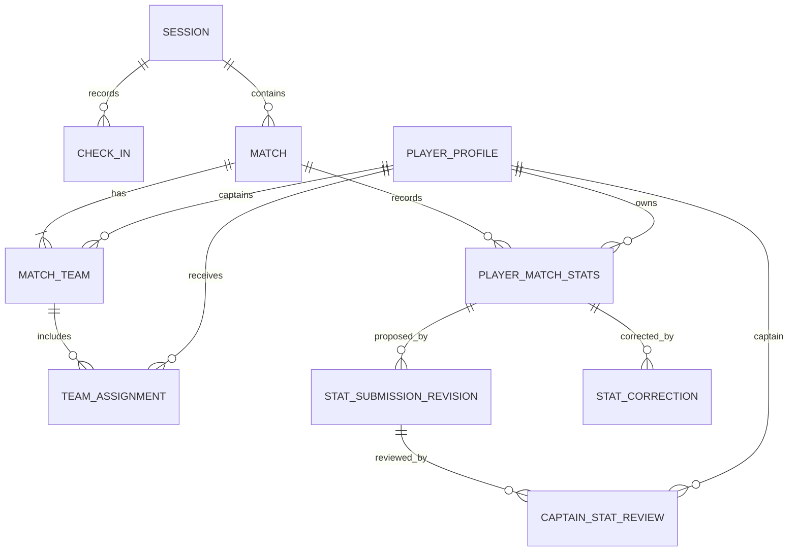
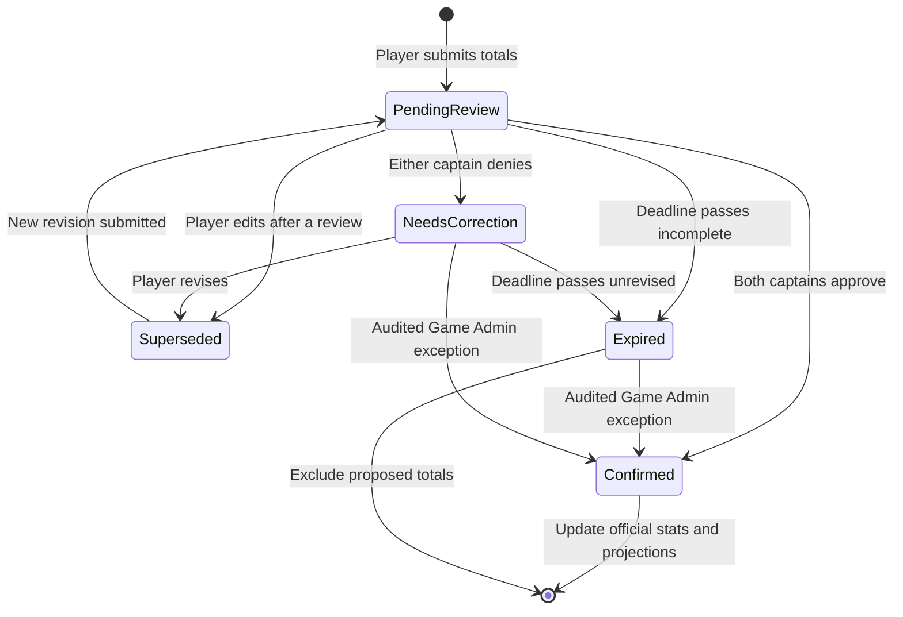

# Simplified Match Stats Confirmation Architecture — Review Plan

> **Status:** Proposed; revised for review before implementation.
> **Scope:** Documentation and architecture only. Do not implement entities, migrations, APIs,
> handlers, or client behavior until this plan is approved.

## 1. Purpose

Provide a lightweight post-match workflow appropriate for casual pickup soccer:

1. Players submit their total goals and assists.
2. Both match captains independently approve or deny each submission.
3. Two approvals automatically confirm the submission.
4. Confirmed submissions update the leaderboard without Game Admin involvement.
5. Game Admin handles only exceptional disputes or corrections when explicitly escalated.

This replaces the earlier per-goal claim, dual-review-per-event, mandatory reconciliation, and
admin-finalization workflow.

Peer ratings, likes, MVP selection, cards, and team balancing are separate workflows and are not
changed by this plan.

## 2. Why this design is simpler

The earlier proposal required one claim per goal, two reviews per claim, conflict substitution,
return/revision states, an admin queue, score reconciliation, and manual publication. That would
create too many post-game actions and make leaderboard updates depend on continued participation
from several people.

The simplified design has one submission per player per match:

```text
Goals: 2
Assists: 1
```

A match with six players claiming a goal or assist therefore needs at most six submissions and
twelve captain decisions, rather than dozens of per-goal reviews. Captains may also use a bulk
“Approve all reviewed” action.

## 3. Simplified end-to-end flow

```mermaid
flowchart TD
    RSVP["Player RSVPs Going"] --> CHECKIN["Game Admin checks player in"]
    CHECKIN --> MATCH["Game Admin creates Match"]
    MATCH --> TEAMS["Assign checked-in players to Team A or Team B"]
    TEAMS --> CAPTAINS["Select one Captain-role player per team"]
    CAPTAINS --> START["Start Match and lock teams/captains"]

    START --> PLAY["Match is played"]
    PLAY --> RESULT["Record final score and close Match"]
    RESULT --> WINDOW["Open stat submission window"]

    WINDOW --> SUBMIT{"Did player record goals or assists?"}
    SUBMIT -- Yes --> TOTALS["Submit total Goals and Assists"]
    SUBMIT -- No --> ZERO["Appearance remains 0 Goals / 0 Assists"]

    TOTALS --> VALIDATE{"Non-negative totals and player participated?"}
    VALIDATE -- No --> INVALID["Reject invalid submission"]
    VALIDATE -- Yes --> PENDING["Pending both captain reviews"]

    PENDING --> CAPTAIN_A["Team A Captain: Approve or Deny"]
    PENDING --> CAPTAIN_B["Team B Captain: Approve or Deny"]

    CAPTAIN_A --> DECISION{"Review status"}
    CAPTAIN_B --> DECISION

    DECISION -- One approval only --> WAITING["Await remaining captain"]
    WAITING --> DECISION

    DECISION -- Both approve --> LIMITS{"Team confirmed totals remain within final score?"}
    LIMITS -- Yes --> CONFIRMED["Automatically confirm player totals"]
    LIMITS -- No --> CHANGES
    DECISION -- Any denial --> CHANGES["Needs correction with denial reason"]

    CHANGES --> BEFORE{"Submission window still open?"}
    BEFORE -- Yes --> REVISE["Player edits totals and resubmits"]
    REVISE --> PENDING
    BEFORE -- No --> EXCLUDE["Keep last unconfirmed totals out of leaderboard"]

    CONFIRMED --> PROJECT["Update season and career projections"]
    ZERO --> PROJECT
    PROJECT --> TOP10["Leaderboard displays top 10"]
    TOP10 --> ALL["View All: search and pagination"]
    PROJECT --> PROFILE["Profile displays totals and overall rank"]

    EXCLUDE --> ESCALATE{"Manual escalation requested?"}
    ESCALATE -- No --> CLOSED["Submission remains unconfirmed"]
    ESCALATE -- Yes --> ADMIN["Game Admin reviews exceptional dispute"]
    ADMIN --> OVERRIDE{"Confirm corrected totals?"}
    OVERRIDE -- Yes --> CONFIRMED
    OVERRIDE -- No --> CLOSED

    CONFIRMED --> CORRECTION{"Correction required after confirmation?"}
    CORRECTION -- Yes --> AUDIT["Game Admin records audited StatCorrection"]
    AUDIT --> PROJECT
```



## 4. Core architecture decisions

### Participation

- `RsvpResponse` records attendance intent only.
- `CheckIn` records actual arrival.
- `TeamAssignment` records participation and team membership for one match.
- Appearance and 0-goal/0-assist stats come from participation, not from a required zero submission.
- Only players assigned to the match may submit stats for it.

### Captains

- Each `MatchTeam` has one optional `CaptainPlayerProfileId`.
- A selected captain must:
  - Hold the Captain role.
  - Be checked in.
  - Be assigned to that match team.
- Teams and captain assignments lock when the match starts.
- Both captains review submissions from both teams.
- A captain may approve their own submission. The opposing captain supplies the independent review.
  This is an intentional casual-pickup tradeoff that avoids routing every captain submission to an
  administrator.
- If a match has no captain for one team, Game Admin may fill that missing review role.

### Player submission

- A player submits one summary per match:
  - `Goals`
  - `Assists`
- Values must be non-negative integers.
- A player who records no goals or assists does not need to submit a 0/0 form.
- A player may edit their submission while it is awaiting review.
- Once either captain has reviewed it, changes create a new revision and reset both captain
  decisions.
- Previous revisions and decisions remain auditable.

### Captain review

- Each captain makes one decision on the complete player submission:
  - `Approve`
  - `Deny`
- Denial requires a short reason.
- Two approvals automatically change the submission to `Confirmed`.
- Before automatic confirmation, the system verifies that the team’s resulting confirmed goals and
  assists would not exceed that team’s recorded final score.
- No Game Admin approval or publication step is required in the normal path.
- Either denial changes the submission to `NeedsCorrection`.
- The player may revise and resubmit while the configured submission window remains open.
- Captains may bulk approve submissions they have reviewed, but denials must be individual and
  include a reason.

### Deadline and exceptions

- The session has a configurable stat-submission deadline.
- Unconfirmed submissions at the deadline do not contribute goals or assists to the leaderboard.
- They do not automatically enter an admin work queue.
- A player or captain may manually escalate an unresolved submission.
- Game Admin may confirm corrected totals or leave the submission unconfirmed, with an audit reason.
- Corrections after confirmation require `StatCorrection`.

## 5. Data model simplification and integrity tradeoff

This plan intentionally changes the existing raw-event direction for goals and assists:

- Confirmed `Goals` and `Assists` totals on `PlayerMatchStats` become the authoritative source for
  those two statistics.
- The system does not create one `MatchEvent` per goal or link an assist to an individual goal.
- `MatchEvent` may remain for independently useful events such as cards or an explicitly recorded
  own goal, but it is not required for the goals/assists leaderboard.
- Derived season and career totals aggregate confirmed `PlayerMatchStats` rows.

This removes significant implementation and review complexity, with these accepted limitations:

- The system cannot prove which assist belonged to which goal.
- The one-assist-per-specific-goal rule cannot be enforced directly.
- Both captains provide the human verification that the submitted totals are correct.
- Automatic validation prevents confirmed team goal totals and confirmed team assist totals from
  exceeding the recorded final score.
- Confirmed player goals may be lower than the final score when a scorer never submits or the score
  includes an own goal. Missing credit is preferable to inventing or blocking stats.

## 6. Simplified domain model

The final architecture should use the existing official `PlayerMatchStats` row and add only the
minimum workflow records needed for review:



Proposed responsibilities:

- `PlayerMatchStats`
  - One official row per match participant.
  - Stores appearance data and the authoritative confirmed goals/assists.
  - Unconfirmed totals never become official values.
- `StatSubmissionRevision`
  - One immutable revision of a player’s proposed goals and assists.
  - References the player and match stats row.
  - Has `PendingReview`, `NeedsCorrection`, `Confirmed`, `Expired`, or `Superseded` status.
- `CaptainStatReview`
  - One decision per captain per submission revision.
  - Stores `Approve` or `Deny`, timestamp, and optional/required reason.
  - Unique per `(SubmissionRevisionId, CaptainPlayerProfileId)`.
- `StatCorrection`
  - Audited post-confirmation adjustment.

No per-goal claim, per-goal review, or goal/assist `MatchEvent` is required.

## 7. Submission state diagram



## 8. Role and authorization model

| Actor | Responsibilities |
|---|---|
| Player | Submit and revise their own goals/assists totals and view review status. |
| Captain | Approve or deny every submitted player summary for that match; optionally bulk approve reviewed summaries. |
| Game Admin | Check in players, create the match, assign teams/captains, fill a missing captain review role, and resolve manually escalated exceptions. |
| Admin/Owner | Inherit Game Admin authority and perform audited post-confirmation corrections. |

Server-side authorization remains authoritative. Client-side control visibility is user experience
only.

## 9. Leaderboard behavior

- A confirmed submission updates the player’s official match stats automatically.
- The normal path does not wait for Game Admin finalization.
- Only confirmed goals and assists contribute to season and career totals.
- Match appearances come from recorded participation even when the player submits nothing.
- The initial leaderboard displays the top 10 qualifying players for the selected metric.
- “View all” opens a searchable, paginated ranking.
- Players with zero values are excluded from Goals and Assists rankings.
- Profiles may show a player’s overall rank even when outside the top 10.
- Audited corrections trigger projection recomputation.

## 10. Wireframe impact

The Match Stats screen should have two modes based on the current user:

### Player submission

- Goals and assists steppers.
- Submit or update totals.
- Status:
  - Awaiting both captains.
  - One of two approved.
  - Confirmed.
  - Needs correction, including the denial reason.
  - Deadline passed/unconfirmed.

### Captain review

- Heading: `Pending stat submissions`.
- One row per player submission, not one row per goal.
- Display player, team, goals, assists, and current other-captain decision.
- Actions: `Approve` or `Deny`.
- Deny opens a required reason input.
- Optional `Approve all reviewed` action.
- Confirmed rows leave the pending list automatically.

Remove normal-path references to:

- Per-goal claims.
- “Pending captain/admin.”
- Mandatory admin reconciliation.
- Manual Game Admin publication.

## 11. Documentation changes after approval

1. Create `documentation/match-stats-flow.md` from this simplified plan.
2. Update `documentation/architecture.md` to link to the detailed flow.
3. Update `_specs/requirements.md` with Gherkin scenarios for:
   - One goals/assists submission per player per match.
   - Dual-captain approval.
   - Automatic confirmation after two approvals.
   - Denial reason and resubmission.
   - Review reset after revision.
   - Automatic rejection of totals that would exceed the recorded team score.
   - Deadline expiry without automatic admin routing.
   - Missing-captain Game Admin fallback.
   - Manual exception escalation.
   - Confirmed-only leaderboard inclusion.
4. Update `_specs/design.md` and `_specs/tasks.md`.
5. Update `documentation/mobile-wireframes.html` and `_specs/client-ui.md` to show the simplified
   player and captain modes.
6. Add durable memory and references in agent guidance.

## 12. Validation and eventual commit

- Validate Mermaid syntax and terminology.
- Verify the architecture, requirements, tasks, and wireframe describe the same workflow.
- Run `git diff --check`.
- Keep the change documentation-only.
- After review approval, commit as:

```text
docs: simplify match stat confirmation architecture
```

No entities, migrations, APIs, handlers, or client behavior should be implemented in that
documentation commit.
